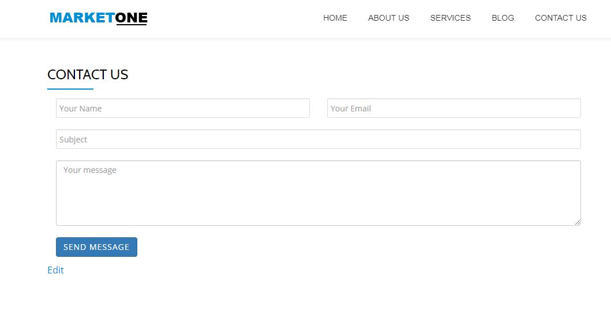

# MarketOne-WordPress-Website
WordPress website for a Digital Marketing Agency.

## Features
Latest version of WordPress - 4.9.5
PHP 7
MySQL
Theme - Parallax-One

## How to install

Clone the project and run in your local environment using MAMP or XAMMP.

